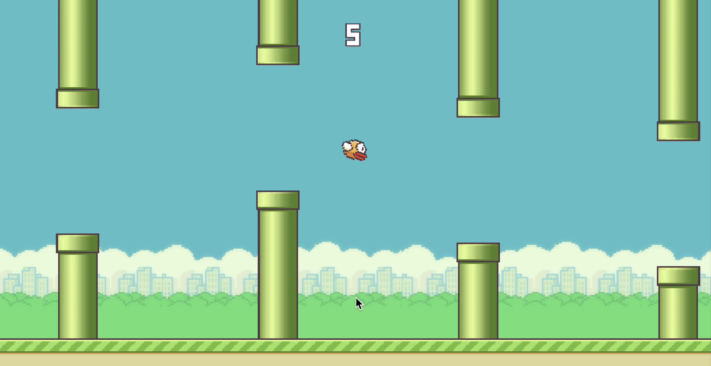

# Flappy Bird Unity Game - Full Stack Web Development Project

## Project Overview
A complete full-stack game development project featuring a Flappy Bird clone built in Unity with a comprehensive web backend for score tracking, user management, and real-time leaderboards. This project demonstrates proficiency in Unity game development, server-side programming with PHP & MySQL, and client-side web technologies.

## Screenshots



*Game Demo*

## Features

### Unity Game
- Complete Flappy Bird gameplay with bird physics and pipe obstacles
- Username system and real-time score tracking
- Automatic score upload to server via HTTP POST requests
- Responsive controls (keyboard/mouse) with smooth 60 FPS performance

### Web Dashboard
- Secure user authentication (registration/login)
- Personal statistics (total games, top score, average)
- Complete score history table
- Real-time leaderboard

### Backend System
- RESTful PHP API with proper HTTP methods
- MySQL database with user and score tables
- Security: password hashing, SQL injection prevention, session management
- Comprehensive error handling and logging

## Live Demo

### Web Dashboard
- **Main Dashboard**: [https://darkslategray-trout-261514.hostingersite.com/dashboard.html](https://darkslategray-trout-261514.hostingersite.com/dashboard.html)
- **Login Page**: [https://darkslategray-trout-261514.hostingersite.com/login.html](https://darkslategray-trout-261514.hostingersite.com/login.html)
- **Registration Page**: [https://darkslategray-trout-261514.hostingersite.com/register.html](https://darkslategray-trout-261514.hostingersite.com/register.html)

### API Endpoints
- **Score Upload**: [https://darkslategray-trout-261514.hostingersite.com/add_score.php](https://darkslategray-trout-261514.hostingersite.com/add_score.php)
- **PHP Code Viewer**: [https://darkslategray-trout-261514.hostingersite.com/code_viewer.php](https://darkslategray-trout-261514.hostingersite.com/code_viewer.php)

## Technical Stack

### Frontend
- **Unity 2021.3+**: Game engine and C# scripting
- **HTML5/CSS3/JavaScript**: Web dashboard with responsive design
- **AJAX**: Dynamic content loading

### Backend
- **PHP**: Server-side logic and API endpoints
- **MySQL**: Database management
- **Hostinger**: Cloud hosting platform
- **C#**: Unity Scripting

### Security
- Password hashing with `password_hash()` and `password_verify()`
- Session-based authentication
- Input validation and sanitization

## Project Structure

```
Assets/
├── Scripts/
│   ├── GameManager.cs          # Main game logic and score management
│   ├── ScoreUploader.cs        # HTTP score upload to server
│   ├── Player.cs               # Bird movement and collision detection
│   ├── Spawner.cs              # Pipe spawning system
│   ├── Pipes.cs                # Pipe movement and destruction
│   └── Parallax.cs             # Background scrolling effect
├── Scenes/
│   └── FlappyBird.unity        # Main game scene
├── Sprites/                    # Game graphics and assets
├── Prefabs/                    # Reusable game objects
└── Materials/                  # Visual materials and effects
```

## Database Schema

### Users Table
```sql
CREATE TABLE users (
    id INT AUTO_INCREMENT PRIMARY KEY,
    username VARCHAR(50) UNIQUE NOT NULL,
    password_hash VARCHAR(255) NOT NULL,
    email VARCHAR(100) UNIQUE NOT NULL,
    created_at TIMESTAMP DEFAULT CURRENT_TIMESTAMP
);
```

### Scores Table
```sql
CREATE TABLE scores (
    id INT AUTO_INCREMENT PRIMARY KEY,
    username VARCHAR(50) NOT NULL,
    score INT NOT NULL,
    level VARCHAR(50) NOT NULL,
    timestamp TIMESTAMP DEFAULT CURRENT_TIMESTAMP
);
```

## API Documentation

### Score Upload (POST)
**Endpoint**: `/add_score.php`
**Parameters**: `username`, `score`, `level`
**Response**: JSON with success status and score data

### User Scores (GET)
**Endpoint**: `/get_user_scores.php`
**Authentication**: Session required
**Response**: JSON array of user's score history

### Leaderboard (GET)
**Endpoint**: `/get_leaderboard.php`
**Response**: JSON array of top 10 scores across all users

## Installation & Setup

### Unity Game Setup
1. Install Unity 2021.3 LTS
2. Open the project in Unity
3. Configure API URL in `ScoreUploader.cs`
4. Build and run the game

### Web Backend Setup
1. Upload web files to hosting provider
2. Create MySQL database and import schema
3. Configure database connection in `db_config.php`
4. Test all endpoints

## Testing Instructions

### Unity Game Testing
1. Launch game and enter username
2. Play and achieve a score
3. Check console for upload confirmation
4. Verify score appears in web dashboard

### Web Dashboard Testing
1. Register new account
2. Log in and view statistics
3. Check leaderboard for rankings


